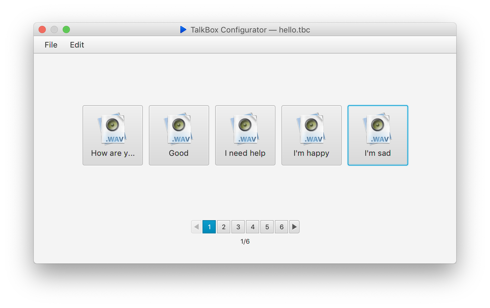

# TalkBox User Guide

TalkBox is a simple Text-to-Speech \(TTS\) device for those with difficulty speaking. Use the TalkBox Configuration App \(TCA\) \(optionally with the TalkBox Simulator\) to configure your unqiue TalkBox to match your needs.

The TalkBox app itself is accessibility-minded, and compatable with most Screen Readers and Assistive Technologies.

