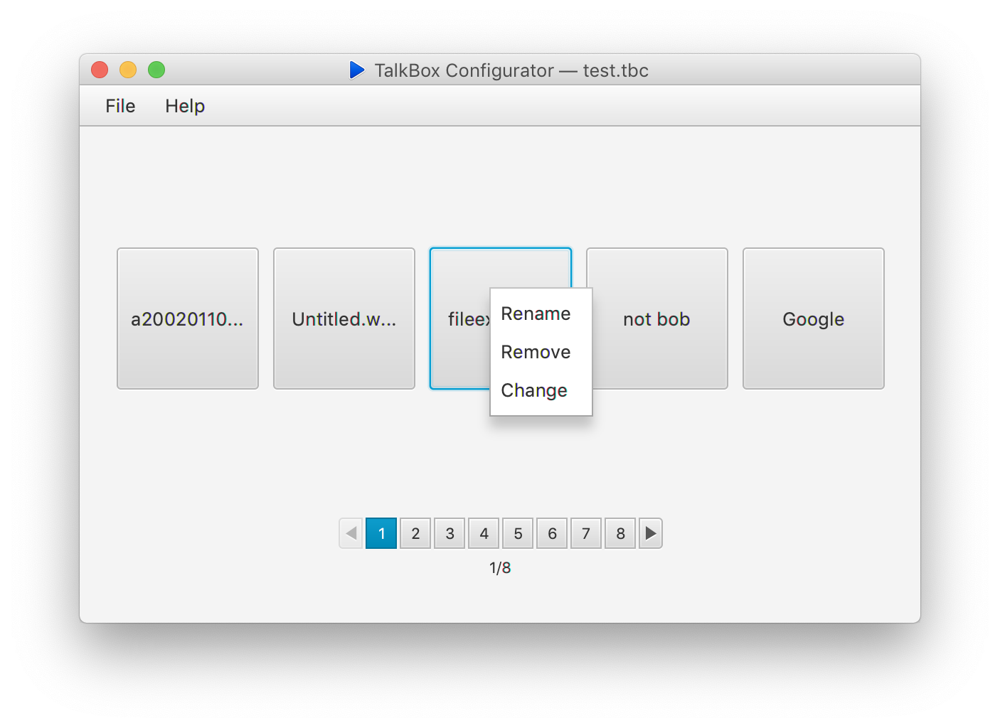
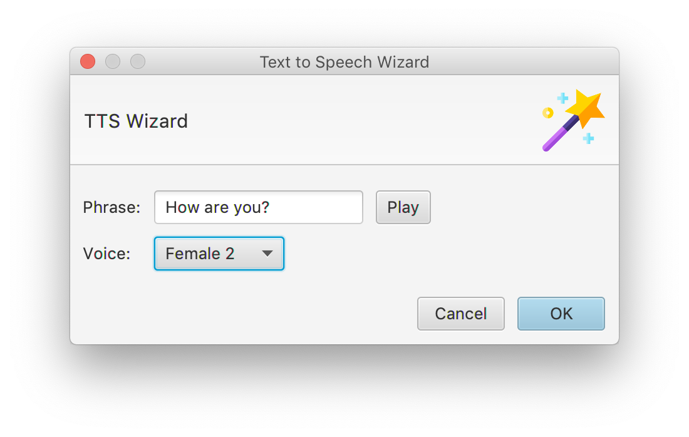
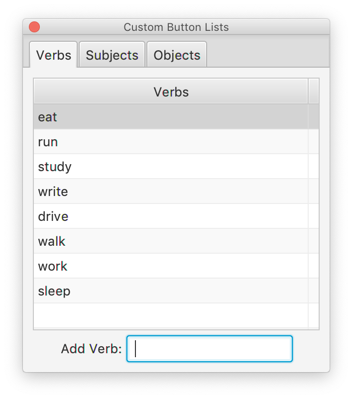

# Using the Configurator

## Getting Started

Download TalkBox from [here](https://github.com/richardrobinson0924/TalkBox2). Once download, double-click to launch and follow the appropriate steps for your device:



Connect the device to your computer, and open its TalkBox Configuration File in the Simulator via clicking "Open Existing file".



If you do not have a device, you can create a virtual TalkBox device by selecting "New TalkBox File". From here, you can customize the number of buttons and choose where to save the Configuration file.



Then, go to `File > Open Configurator` to open your TBC file in the TalkBox Configuration App.

## Using the Configurator

The TBC automatically detects the number of audio buttons and audio sets your TalkBox has. Once you open a TalkBox Configuration File, you can use the TBC to add, remove, and configure the TalkBox buttons.

#### Adding Audio

If a button doesn't already contain audio, simply click the button to create an audio file using the TTS Wizard. You can also right click and select "Change" to either replace or add an existing audio file, or drag the audio file onto the button.

If you already have a directory of audio files, use `File > Import` button to import all compatable files onto available buttons.

#### Modiying the Audio Source

To change a button's audio source, right click on the button and select `Change`. To remove an audio source, right click and select `Remove`. Lastly, to change the default label of a button, select `Rename`. You can always undo any changes you make using `Edit > Undo`.

## Using the TTS Wizard

The TTS Wizard is a powerful Natural Language TTS service using Google Cloud™. To use the TTS Wizard, go to `File > Launch TTS Wizard`.


To hear how the audio sounds without exporting it, click the `Play` button


Here, you can enter a custom phrase and select from one of six unique voices to have it converted to audio.  Once you're done, click `OK` to save the new audio file for use with the TBC.



The TTS Wizard works best when connected to the internet, however a lower-quality TTS service will be used when a connection cannot be established.

## Using the Custom Phrase Generator \(CPG\)

In addition to preset audio files, you can use your TalkBox to automatically generate custom phrases as audio in real time by creating a sentence from simple words. To set up the Custom Phrase Generator, go to `View > Open Custom Phrase List`. 

Here, you can customize the list of nouns, verbs, subjects, etc to be available on the TalkBox to generate the sentences. The operation of the CPG is explained further in [Using TalkBox Device](using-talkbox-device.md#using-talkbox).

## Exporting to Device

Once you're done configuring your TalkBox, simply go to `File > Save` to save the file back onto your TalkBox or TalkBox Simulator. Using `File > Export`, you can also save it to a custom location. Now you're ready to use your TalkBox!

