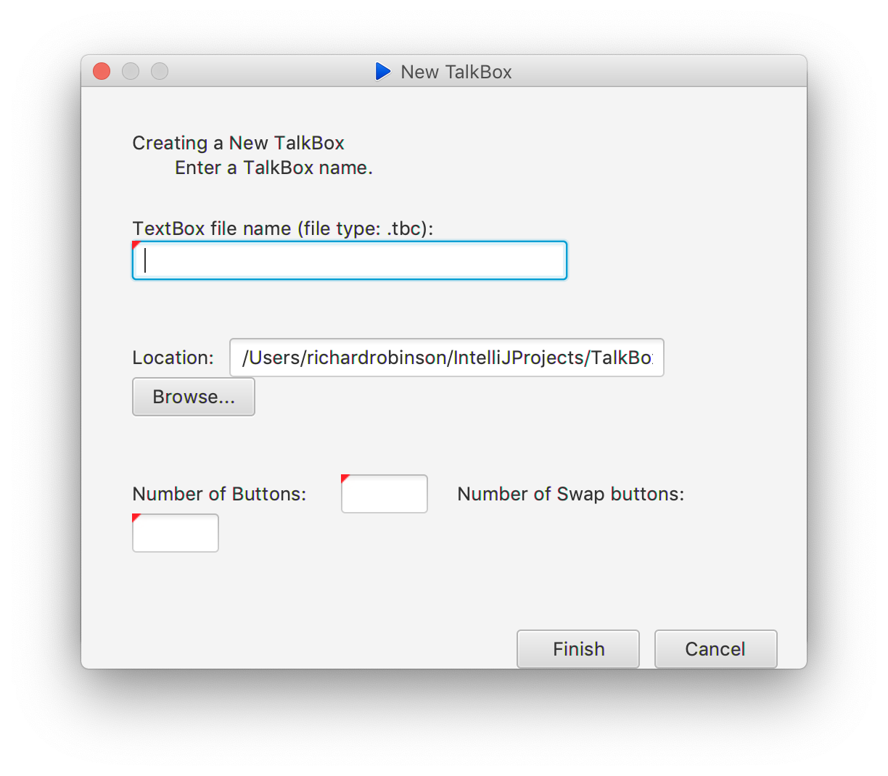

# Using TalkBox Device

## Setting up the Device

You can use either a TalkBox device or the TakBox simulator to see how your device will operate. To set up, follow the appropriate directions below:



The TalkBox device already comes with a TBC file specifying its number of buttons and audio sets. So all you need to do is connect to your computer!



1. On the Simulator, you can either open an existing TBC file or create a new one
2. If you create a new TBC file, the Set Up Wizard will guide you to customize the number of buttons and audio sets
3. Otherwise, the TBC file is opened in the simulator, which acts like a standard TalkBox Device.



## Using TalkBox

Once your TalkBox is set up, it's simple to use. Simply click on any of the assigned audio buttons once to preview the audio file's name on the display, and twice to play the audio. Or, click a swap button to go to the next audio set.

If you wish to create your own sentences, click the `Custom` button. Each audio set transforms into a part of speech \(nouns, verbs, tense, etc\). For each audio set, select the desired word, and the sentence will be displayed in real time. 

When you are finished, click `Play` to generate and play the custom audio via TTS. Otherwise, click `Custom` again to return to the default mode.

