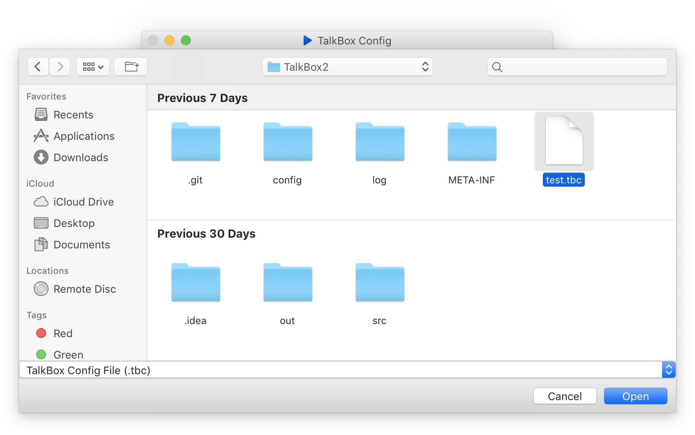

# Using the Configurator

## Getting Started

Download TalkBox from [here](https://github.com/richardrobinson0924/TalkBox2). Once download, double-click to launch and follow the appropriate steps for your device:TalkBox DeviceTalkBox Simulator



Connect the device to your computer, and extract its TalkBox Configuration File.



Launch the TalkBox Simulator from `File > Simulator` and create a virtual TalkBox device. Then, export the configuration file



Then, go to `File > Open` to open your TBC file from either a device or the simulator

## Using the Configurator

The TBC automatically detects the number of audio buttons and audio sets your TalkBox has. Once you open a TalkBox Configuration File, you can use the TBC to add, remove, and configure the TalkBox buttons. If a button has an audio source, click it to play or use ⌘ \(macOS\) or Ctrl \(Windows\) + the number of the button you wish to play.

#### Adding Audio

To set a button's audio, simply drag the audio file onto the button. Alternatively, if a button doesn't contain audio, you can click the button to select the audio source.

#### Modiying the Audio Source

To change a button's audio source, right click on the button and select `Change`. To remove an audio source, right click and select `Remove`. Lastly, to change the default label of a button, select `Rename`.

## Using the TTS Wizard

The TTS Wizard is a powerful Natural Language TTS service using Google Cloud™. To use the TTS Wizard, go to `File > Launch TTS Wizard`.


To hear how the audio sounds without exporting it, click the `Play` button


Here, you can enter a custom phrase and select from one of six unique voices to have it converted to audio.  Once you're done, click `OK` to save the new audio file for use with the TBC.



## Exporting to Device

Once you're done configuring your TalkBox, simply go to `File > Save` to save the file back onto your TalkBox or TalkBox Simulator. Using `File > Export`, you can also save it to a custom location. Now you're ready to use your TalkBox!

